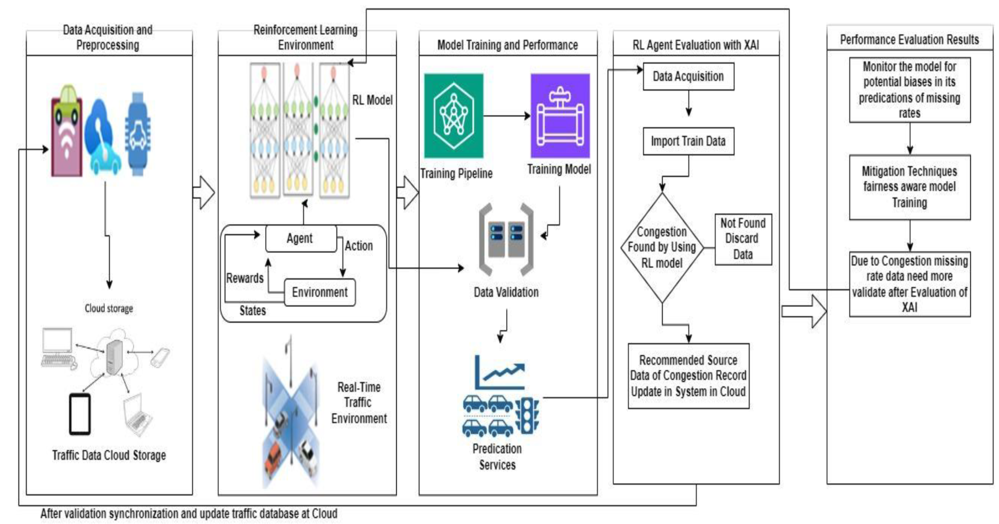

# Towards Transparent Traffic Solutions: Reinforcement Learning and Explainable AI for Traffic Congestion

**Authors**: Shan Khan, Taher M. Ghazal, Tahir Alyas, M. Waqas, Muhammad Ahsan Raza, Oualid Ali, Muhammad Adnan Khan, Sagheer Abbas  
**Published in**: *International Journal of Advanced Computer Science and Applications (IJACSA)*, Vol. 16, No. 1, 2025  

---

## 📄 Abstract Summary
- Introduces a **novel approach** to traffic congestion detection in Smart Cities.  
- Combines **Reinforcement Learning (RL)** for **real-time adaptability** with **Explainable AI (XAI)** for **transparent and interpretable decision-making**.  
- Key contributions:  
  - **Reduced missing data rate** in traffic prediction.  
  - **Improved prediction accuracy** (reported at **98.10%**).  
  - Ensures **data security and privacy** in transmission between IoT devices and cloud servers.  
  - Provides **interpretable results** that build trust for real-world deployment.  
<!-- - Demonstrates ~**5% improvement** in security, reliability, and accuracy compared to existing approaches.  -->
- Proposed RL-XAI framework shows potential for more **intelligent and efficient traffic management systems**.  

## Limitations of Previous Work
Previous works struggle with data **quality, scalability, interpretability, and real-time feasibility**, which this paper tries to address with its RL + XAI approach.

- **Complexity of traffic system**  
  - Traffic depends on many interrelated factors (road conditions, weather, human actions).  
  - Many ML models fail to capture all these factors → poor predictions.  

- **Data dependency**  
  - ML models are **data-hungry**.  
  - Collecting **large, real-time traffic datasets** is difficult.  
  - Data anomalies or biases can reduce performance.  

- **Scalability issues**  
  - Models trained for one city/location often **don’t transfer** well to others.  
  - Hard to scale across large metropolitan areas.  

- **Transparency/Interpretability**  
  - Some techniques try to make RL interpretable (like blockchain, fusion methods).  
  - Results are often **contradictory or unclear**, limiting trust.  

- **Ethical & Regulatory challenges**  
  - RL-based real-time decisions raise **safety, privacy, fairness, and compliance** concerns.  

- **Computational cost**  
  - Training ML (especially RL and deep models) requires **heavy resources**.  
  - Real-time traffic systems often have **limited processing power**, making deployment difficult.  

## Methodology

- Step 1: Data Acquisition
  - Collect multiple sources of data
  - Traffic data (vehicle counts, density, traffic flow)
  - Weather Conditions (rain, fog, snow)
- Step 2: Data Pre-processing
  - Clean the raw data (remove errors or missing values)
  - Extract important features (average speed)
  - Normalize the values (scales the data)
- Step 3: RL Environment
  - The RL agent observes the state (traffic density, speed, weather).
  - It chooses actions (e.g., adjust traffic lights, recommend alternate routes, send congestion warnings).
  - The reward comes from outcomes (reduced congestion, faster travel times).
- Step 4: Training
  - Training happens in a simulation environment that mimics real-world traffic.
- Step 5: Simulation Environment
  - The RL agent is trained in a virtual setup that mimics real-world traffic (roads, signals, events).
  - Safer and cheaper than experimenting directly on live roads.
- Step 6: Integration with XAI
  - Once the RL agent is trained, XAI is applied to explain why the agent takes certain actions.
  - Example: If the agent changes a traffic light, XAI points out the reasons (e.g., high density, long wait time, environmental impact).
- Step 7: Sub-rewards in Decision Making
  - The reward function isn’t just one number. It is broken down into components:
      - Travel time
      - Safety
      - Environmental impact
  - XAI shows how each sub-reward influenced the final decision.
 ## Result Analysis
 - Evaluation Metrics
   - Accuracy (percentage of correct predictions).
   - Miss rate (percentage of cases where congestion was missed or misclassified).
- Proposed RL-XAI:
  - Training accuracy ~ 98.7–98.9%
  - Validation accuracy ~ 98.10%
  - Miss rate: ~ 1.2–1.9%
![Alt text] (rl_XAI_results.png "Results")
