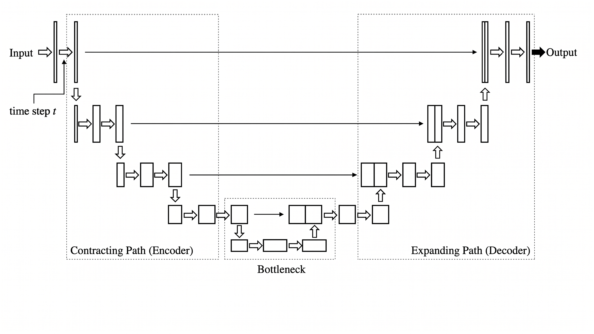

## What is the Diffusion Model?
It is a branch of AI that actually learns to predict noise. We can think of it as a **noise detective**. There are two steps in the diffusion process:
 - **Forward Process (Destroying Phase)**:
   - In this process, the model injects noise into the data. At each timestep $t$, it increases the noise, and at the final T, the data become indistinguishable.
   - There is no learning in this phase, this phase only turns the original data into a noisy version.
  
 - **Reverse Process (Reverse Diffusion)**:
   - ML learning happens in this phase.
   - We train a neural network (U-Net) that actually learns to predict the noise that was added in the first Phase.
   - At every time step, if the model can predict the noise accurately, we subtract that from the noisy data and move one step ahead to the clean data.
   - To generate a new image, the model starts with pure random noise and asks to denoise it repeatedly utill a high fidelity data is generated.

    
   
    *Figure 1: Diffusion model turning noise into a picture*
   
*Image by Sama Bali via [Nvidia Technical blog](https://developer-blogs.nvidia.com/wp-content/uploads/2024/07/diffusion-model-building.gif)
  ## Core Objective: "Noise Prediction"
  The goal is to learn a function that could be a neural network, which can look at a blurry image and can guess exactly what noise was added here.
  The simplified loss function : 
  
  $$L = E_{x,\epsilon} [|| \epsilon - \epsilon_\theta (x_t,t)||^2]$$

  - $\epsilon$ : True noise
  - $\epsilon_\theta (x_t,t)$: Predicted Noise
  - $||...||^2$: MSE
### Example
1. **Forward Pass**: You pour a drop of milk(noise $\epsilon$) into coffee, and you mix it.
2. **Challenge**: You show that one to your friend and ask them to show how exactly the milk drop looked before it hit the coffee?
3. **Learning**: If your friend predicts a huge splash but actually you added a tiny drop, the loss is high. Since your friend predicted a larger one, he set up his mind calculation in a way that he would predict a smaller drop next time. That's exactly how model update internal weights ($\theta$) so that next time the loss can be reduced.

**Here, your friend is the diffusion model, milk is the noise, and coffee is the data.**
## Why do we predict noise instead of the image?
The simple answer is **complexity**. 
1. **Stable training**: Predicting a clear image from pure noise is a huge task. It is something like you have a single sentence, and you are trying to write a complete novel of 700 pages. So, predicting noise instead of more manageable task for the neural network.
2. **Gradient Stability**: The loss function for predicting noise(MSE) provides a consistent gradient, whereas predicting a complete image leads to too small or too large losses, causing instability.
3. **Simplified Objective**: Mathematically, the training process of predicting noise is way more simplified than predicting a complete image.

## U-Net Architecture
It is a neural network that is mainly used for image segmentation tasks. It has three major parts:
1. **Encoder**: At the beginning, the image is divided into small parts followed by several convolution and pooling layers, resulting in  small features, shapes, etc.
2. **Bottleneck**: The most compressed information of the image is stored here, and it connects the encoder with the decoder.
3. **Decoder**: Decoders take the abstract information. It uses upsampling and combines information from the encoder using **Skip Connection**. These connections provide the spatial details from the encoder layers to refine the output.

*Figure 2: U-Net Architecture*
