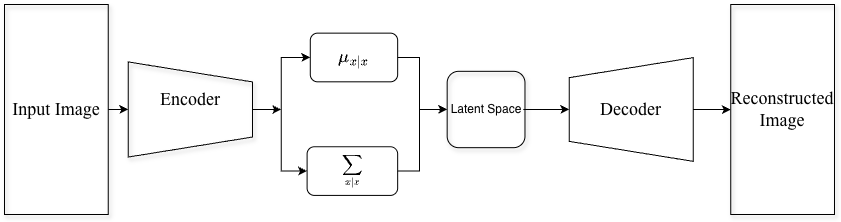

## What is the Diffusion Model?
It is a branch of AI that actually learns to predict noise. We can think of it as a **noise detective**. There are two steps in the diffusion process:
 - **Forward Process (Destroying Phase)**:
   - In this process, the model injects noise into the data. At each timestep $t$, it increases the noise, and at the final T, the data become indistinguishable.
   - There is no learning in this phase, this phase only turns the original data into a noisy version.
  
 - **Reverse Process (Reverse Diffusion)**:
   - ML learning happens in this phase.
   - We train a neural network (U-Net) that actually learns to predict the noise that was added in the first Phase.
   - At every time step, if the model can predict the noise accurately, we subtract that from the noisy data and move one step ahead to the clean data.
   - To generate a new image, the model starts with pure random noise and asks to denoise it repeatedly utill a high fidelity data is generated.

    
   
    *Figure 1: Diffusion model turning noise into a picture*
   
*Image by Sama Bali via [Nvidia Technical blog](https://developer-blogs.nvidia.com/wp-content/uploads/2024/07/diffusion-model-building.gif)
  ## Core Objective: "Noise Prediction"
  The goal is to learn a function that could be a neural network, which can look at a blurry image and can guess exactly what noise was added here.
  The simplified loss function : 
  
  $$L = E_{x,\epsilon} [|| \epsilon - \epsilon_\theta (x_t,t)||^2]$$

  - $\epsilon$ : True noise
  - $\epsilon_\theta (x_t,t)$: Predicted Noise
  - $||...||^2$: MSE
### Example
1. **Forward Pass**: You pour a drop of milk(noise $\epsilon$) into coffee, and you mix it.
2. **Challenge**: You show that one to your friend and ask them to show how exactly the milk drop looked before it hit the coffee?
3. **Learning**: If your friend predicts a huge splash but actually you added a tiny drop, the loss is high. Since your friend predicted a larger one, he set up his mind calculation in a way that he would predict a smaller drop next time. That's exactly how model update internal weights ($\theta$) so that next time the loss can be reduced.

**Here, your friend is the diffusion model, milk is the noise, and coffee is the data.**
## Why do we predict noise instead of the image?
The simple answer is **complexity**. 
1. **Stable training**: Predicting a clear image from pure noise is a huge task. It is something like you have a single sentence, and you are trying to write a complete novel of 700 pages. So, predicting noise instead of more manageable task for the neural network.
2. **Gradient Stability**: The loss function for predicting noise(MSE) provides a consistent gradient, whereas predicting a complete image leads to too small or too large losses, causing instability.
3. **Simplified Objective**: Mathematically, the training process of predicting noise is way more simplified than predicting a complete image.

## U-Net Architecture
It is a neural network that is mainly used for image segmentation tasks. It has three major parts:
1. **Encoder**: At the beginning, the image is divided into small parts followed by several convolution and pooling layers, resulting in  small features, shapes, etc.
2. **Bottleneck**: The most compressed information of the image is stored here, and it connects the encoder with the decoder.
3. **Decoder**: Decoders take the abstract information. It uses upsampling and combines information from the encoder using **Skip Connection**. These connections provide the spatial details from the encoder layers to refine the output.

*Figure 2: U-Net Architecture*
## Variational Encoder (VAE)
VAE is like a high-tech "translator" that translates the messy, high-dimensional data into a compact, organized "concept space."
### Fundamental Difference With Autoencoder
An autoencoder tries to compress an image into a small vector, whereas the VAE tries to learn a probability distribution of an image instead of single vector.

### Architecture of VAE

_Figure 3: VAE architecture_
### Encoder
The encoder takes an image (a 512*512 image of a face) and passes it through convolution layers. Instead of generating a vector, it generates the mean and the variance.
### Laten Space
The latent space uses the $\mu$ and $\sigma$ to create a bell curve (Gaussian Distribution). This ensures that if you pick any point near the center, it will look like a valid face.
### Decoder
Decoder takes a random sample from the bell curve and tries to redraw the original image.

### Example
Imagine we want to teach a computer to draw houses.

**Autoencoder:** It memorizes specific houses. If you ask it to draw something "halfway" between a cottage and a skyscraper, it might output a blurry mess because it doesn't understand the "space" in between.

**VAE**: Encoder looks at 1,000 houses and realizes they all have "Height" and "Number of Windows." In the Latent Space, it maps "Height" to one axis and "Windows" to another. Instead of memorizing one specific house, it learns the range of what a house can be.

**Result:** If you pick a point in the middle of the latent space, the Decoder can generate a house that has never existed but looks perfectly realistic because it understands the **"rules" of the distribution**.

_However, AEs have a limitation: they cannot generate new data points, as their latent representations are fixed and not probabilistic._

### Where to use which one?
**AE:** Tasks like dimensionality reduction and feature extraction.

**VAE:** Tasks like image and text generation, where we need to generate new datapoints.
### Why is diffusion fast?
Diffusion uses VAE, which compresses a larger image (512 * 512) into a latent grid of smaller dimensions (64*64). While denosing, the diffusion model only uses the latent grid, and once denoising is done, the VAE decoder up-scales that latent grid back into a 512*512 image. That's why the diffusion model is so fast.

### Math Objective
### Role of KL Divergence in VAEs
KL divergence acts as a regularization tool in VAEs, it makes sure that the learned latent distribution $q(z|x)$ stays close to the Normal Distribution.
By forcing the learned latent space towards a normal distribution, the model avoids overfitting and ensures that the model exactly knows where to search for noise.
### What Is ELBO, and Why Does It Matter?
The Evidence Lower Bound (ELBO) is the objective function that actually balances reconstruction and regularization. The loss function for a VAE is the sum of two competing terms:

$$\mathcal{L}_{VAE} = \text{Reconstruction Loss} + \cdot \text{KL Divergence}$$

1. Reconstruction Loss: Measure how well the VAE can redraw the data from the latent space. A higher value indicates better reconstruction.
2. KL Divergence: Ensure the distribution learned by the encoder stays close to the **Standard Normal Distribution**.

### Example: The "Color Palette."
Imagine we are training a VAE on colors. 
- **Without KL Divergence:** Red is at coordinate (100, 100) and Blue is at (-500, 20). There is nothing in between. If you pick (0, 0), the model has no idea what color that is.
- **With KL Divergence:** Red is at $(0.1, 0.2)$ and Blue is at $(-0.1, -0.3)$. Because they are forced into the same small "ball" around zero, the space between them must be Purple.
