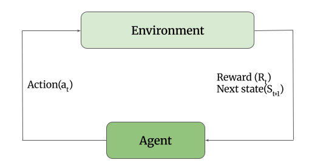

## Intro to Reinforcement Learning and Planning
Reinforcement Learning is all about learning by trial and error through interaction. It is a continuous and cyclic conversation between the agent and the environment.

Let's introduce the basic jargon of RL.
- **Agent**: Agent is the brain of RL, it is the controller or algorithm that interacts with the environment and makes decisions based on the interaction.
- **Environment**: It is the world where the agent interacts, and it executes the agent's decision and provides feedback. Based on the feedback, the agent takes the next steps.

Now we will learn about the Mathematical Vocabulary of RL.
- **State($S_t$)**: State is the snapshot of the environment at a specific moment, which is used by the agent to make a decision. In other words, states are being observed by the agent.
  - _For example, an Intersection Control Agent observes the **Queue Length** of lanes, **Waiting Time** of vehicles, etc., to efficiently change the signal phase;
 in that case **Queue Length**, **Waiting Time** are the states for this agent_.
- **Action($A_t$)**: Decision on control input chosen by the agent based on the states that it observed.
  - Action 0: Keep the current Green Phase on
  - Action 1: Switch to yellow/red phase.
- **Reward($R_t$)**: This is the single scalar number returned by the Environment after executing the action. It actually evaluates how good or bad the action was in that immediate short term.
  The ultimate goal is to maximise the total accumulation of the rewards.

## The RL Loop
The agent observes the states of the world and makes a decision or action. The environment executes that action in the environment and evaluates this action by calculating the reward.
Finally, the agent sends that reward and the next state ($S_{t+1}$) corresponding to the action that was made by the agent.

*Figure 1: Reinforcement Learning Loop*
 - **Episode**: Episode is one complete sequence of the RL loop from the initial state $S_0$ to the designated **terminal state**. Once the agent reaches the terminal state, the environment resets to the initial state and starts a new episode.
   - For example, running a traffic simulation of the rush morning hour starts from 6 AM($S_0$) and terminates at 9 AM($S_{\tau}$).
 - **Episode Length($T$)**: Total number of states an agent took to reach to the terminal state in a particular episode. If the traffic simulator updates every 1 second, a 3-hour rush episode has an episode length $T=10800$ steps.

## The Policy ($\pi$): Brain
The policy is simply the agent's rulebook, mapping the current state of the world to the action it should take. If the State is the question the environment asks, the Policy is the answer the agent gives.

Plocies comes in two flavours:

1. **Deterministic Policy**: The agent follows a strict, non-random rule. For a specific state, the agent will always take the same action. For example, a Chase agent, for specific moves it will take the same steps.

$$a= \pi(s)$$

2. **Stochastic Policy**: Instead of a specific action, a policy returns a probability distribution of all actions. In other words, given a state, the agent will choose an action randomly based on the probability distribution. For example, in a poker game, the agent may not always choose the same action for the same state.

$$\pi(a|s) = \mathbb{P}[A_t = a | S_t = s]$$

### Discount Factor $(\gamma)$
Gamma is a number between $0$ and $1$. We multiply future rewards by $\gamma$, compounding it for every step into the future.
The Discounted Return Equation:

$$G_t = R_{t+1} + \gamma R_{t+2} + \gamma^2 R_{t+3} + \dots = \sum_{k=0}^{\infty} \gamma^k R_{t+k+1}$$

How $\gamma$ shapes the agent's personality:

  - If $\gamma = 0$: The agent is perfectly short-sighted. It only cares about the immediate next reward ($R_{t+1}$).
  - If $\gamma = 0.99$: The agent is deeply strategic, heavily weighting events that happen far into the future.
