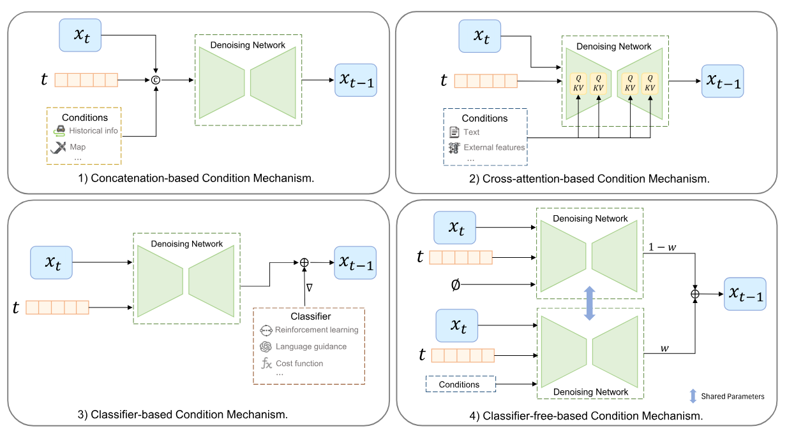
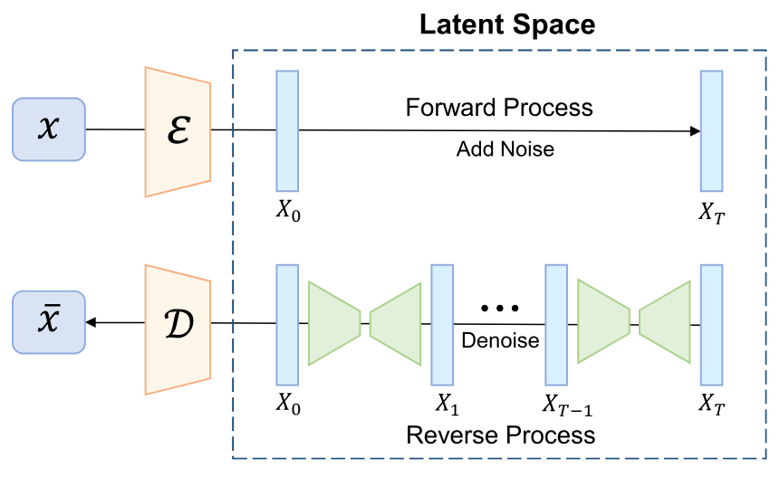

 
 Diffusion Models for Intelligent Transportation Systems: A Survey 

   ## Variants of Diffusion Models
   While the standard diffusion model learns to generate random data from scratch, applying it in the real-world complex ITS requires significant 
   control and efficiency. However, researchers use two major variants to achieve this efficiency.
  
   1. Conditional Diffusion Model
   2. Latent Diffusion Model (LDM)
  
  ## Conditional Diffusion Model:
  Standard Diffusion models are unconditional; they only use the noisy data and the current step of the denoising process. Whereas the conditional diffusion model allows us to inject extra information,
  for example, historical traffic data, road maps, or text prompts to control what exactly to generate. Conditioning Mechanisms:
  
  
  
  _Figure 1: Different condition mechanisms for diffusion models_
  
  ### 1. Concatenation-based CDM
  The conditioning information is directly added to the data $x$ or to the diffusion step $t$. It is simple and highly effective for tasks like predicting future traffic flow or vehicle trajectories
  
  ### 2. Cross-attention-based CDM
  Cross-attention is used when the condition and the output are from different modalities. For example, when we would like to use both the prompt and the BEV feature to generate a scene.
  
  ### 3. Classifier-Based CDM
  This approach uses an external classifier (like a cost function and a reinforcement learning algorithm) to guide the generation process. It makes sure that the generated trajectory is actualy obey traffic rules and physical constraints.
  
  ### 4. Classifier-free-based CDM
  This method accumulates both conditional and unconditional diffusion models without training a separate classifier.
  It works by blending the output of conditional and unconditional diffusion models, which is highly useful for generating realistic scenarios. 
  
  ##  Latent Diffusion Models (LDMs) 
  
  
  _Figure 1: Illustration of Latent Diffusion Models_
  
  LDMs use a pre-trained encoder to compress the traffic data into a smaller, lower-dimensional representation called a latent space. The process of adding and removing noise happens entirely within this compressed space, and the final result is then decoded back into standard data. By operating in this latent space, LDMs drastically reduce the computational power required, enabling much faster training and inference.
  
  ## Challenges in Intelligent Transportation Systems 
  1. Absence of Quality Data
  2. Privacy Issue
  3. Lack of Rare Events
  4. Difficult to Model Complex Traffic Dynamics
  5. Weak Scalability and Generalization
  6. Lack of user-friendly interaction
  
  ## Advantages of Diffusion Models 
  While traditional deep learning approaches (like RNNs or GNNs) struggle with incomplete data, and standard generative models (like GANs or VAEs) suffer from unstable training and mode collapse, diffusion models offer specific advantages that directly counter these ITS challenges.
   - **High-Fidelity Generation**: Diffusion models can generate high-quality data in traffic-related tasks, and on top of that, training a diffusion model is easier and exhibits superior performance than VAEs and GANs. Additionally, by generating synthetic data, it can address the traffic data privacy concern.
   - **Controllable Generation**: By using a conditional diffusion model, it can generate traffic layout, environmental factors, and textual instructions aligned with a specific goal and context.
   - **Strong Flexibility**: The diffusion model can be integrated with other techniques, including GNNs, Reinforcement Learning, GANs, and VAEs.
   - **Multimodal Capabilities**: The diffusion model can handle multimodal data due to its stepwise denoising mechanisms. Latent Diffusion Model (LDMs) encode different modalities into a compact latent space.

  
 DiffUser: Planning with Diffusion for Flexible Behavior Synthesis 

  
 _Some Basic Note_
 
 **Model**: In RL model does not mean the conventional Neural network or ML models, "Model" is the mathematical understanding of the environment of an agent.  
 ### **Model-Free Reinforcement Learning**: 
 The agent interacts with the environment and learns the action and states only, it does not have any idea of the internal mechanics of the environment. It learns by trial and error. For example, an agent that handles intersection control of mixed autonomy does not need to learn the physics of car acceleration, driver reaction times, or complex traffic flow equations. It learns through direct interaction with the environment and tracks the reward of different actions.
 - **Algorithms**: PPO, DQN, Q-learning
 ### **Model-Based Reinforcement Learning**: 
 The agent learns how the environment works, it actually learns the model of the environment before making a move. This model-based agent is implemented when the environment is strict and well-known. For example, an agent learns to play chess, it actually knows how the board looks, what the moves of the knight are, and it knows the exact rewards (win, loss, or draw).
 - **Algorithms**: AlphaZero, Dyna-Q

